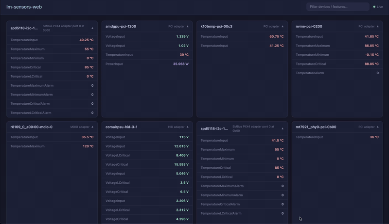

# lm-sensors-web

Hardware sensor monitoring web application built in Rust. Exposes real-time sensor data (temperatures, voltages, fan speeds) from Linux `libsensors` via REST API, WebSocket live-feed, webhooks, and a dark-mode web dashboard.

[](LICENSE)
[](https://www.rust-lang.org)
[](https://crates.io/crates/lm-sensors-web)
[](https://github.com/dipenpradhan/lm-sensors-web/actions)



---

## Features

| Feature | Description |
|---------|-------------|
| **REST API** | Device listing, details, readings, health check |
| **WebSocket** | Real-time sensor broadcast with auto-reconnect |
| **Webhooks** | Scheduled HTTP push with temperature/on-change triggers |
| **Web Dashboard** | Dark-mode UI with live filtering and sensor cards |
| **CLI** | Full-featured CLI with service management subcommands |
| **Systemd** | Install/manage as a Linux system service |
| **Docker** | Multi-stage build with health checks |
| **Hot-reload** | Update config without restarting |
| **Testing** | 80+ unit and integration tests |

---

## Quick Start

```bash
# Build
cargo build --release

# Run (binds to 0.0.0.0:47890)
./target/release/lm-sensors-web

# Open dashboard
open http://localhost:47890
```

---

## Documentation

| Document | Description |
|----------|-------------|
| [User Guide](docs/USER_GUIDE.md) | Complete usage guide with examples |
| [API Reference](docs/API_REFERENCE.md) | All endpoints, schemas, and examples |
| [Deployment Guide](docs/DEPLOYMENT.md) | Production deployment strategies |
| [Troubleshooting](docs/TROUBLESHOOTING.md) | Common issues and solutions |
| [Testing Guide](docs/TESTING.md) | Test suite overview and best practices |

---

## Endpoints

| Method | Path | Description |
|--------|------|-------------|
| `GET` | `/` | Web dashboard |
| `GET` | `/api/health` | Health check / liveness probe |
| `POST` | `/api/reload` | Hot-reload configuration |
| `GET` | `/api/devices` | List all sensor devices |
| `GET` | `/api/devices/{id}` | Get device by name |
| `GET` | `/api/devices/{id}/features` | Get device readings |
| `GET` | `/ws/sensors` | WebSocket live feed |

---

## Configuration

```json
{
  "server": {
    "host": "0.0.0.0",
    "port": 47890,
    "log_level": "info"
  },
  "websocket": {
    "enabled": true,
    "path": "/ws/sensors",
    "broadcast_interval_ms": 2000
  },
  "webhooks": [
    {
      "name": "temp-alert",
      "url": "http://localhost:9090/alerts",
      "trigger": "temperature",
      "condition": {"above_celsius": 80},
      "interval_seconds": 30
    }
  ],
  "sensors": {
    "refresh_interval_ms": 5000
  }
}
```

---

## CLI Reference

```bash
# Start server with defaults
lm-sensors-web

# Custom host, port, config, log level
lm-sensors-web -H 127.0.0.1 -p 8080 -c config.json --log-level debug

# Service management
lm-sensors-web install-service --binary /usr/local/bin/lm-sensors-web --config /etc/lm-sensors-web/config.json
lm-sensors-web start-service
lm-sensors-web status-service
lm-sensors-web stop-service
lm-sensors-web uninstall-service
```

---

## Docker

```bash
# Build and run
docker compose up -d

# Or standalone
docker run -p 47890:47890 -v $(pwd)/config.json:/app/config.json:ro lm-sensors-web:latest
```

---

## Testing

```bash
# Run all tests
cargo test

# Unit tests only
cargo test --lib

# Specific test file
cargo test --test api_endpoints
```

---

## Project Structure

```
src/
  main.rs          — Entry point (CLI + server startup)
  lib.rs           — Public module re-exports
  api/             — REST route handlers
    health.rs      — GET /api/health, POST /api/reload
    sensors.rs     — GET /api/devices/*
  cli.rs           — clap CLI parsing
  config.rs        — JSON config schema + loading
  sensors.rs       — lm-sensors wrapper + data types
  server.rs        — Axum router construction
  service.rs       — systemd service management
  state.rs         — Shared application state
  webhook.rs       — Webhook dispatch engine
  websocket.rs     — WebSocket broadcast server
static/            — Frontend assets (HTML/CSS/JS)
tests/             — Integration tests
docs/              — Documentation
```

---

## License

Apache-2.0