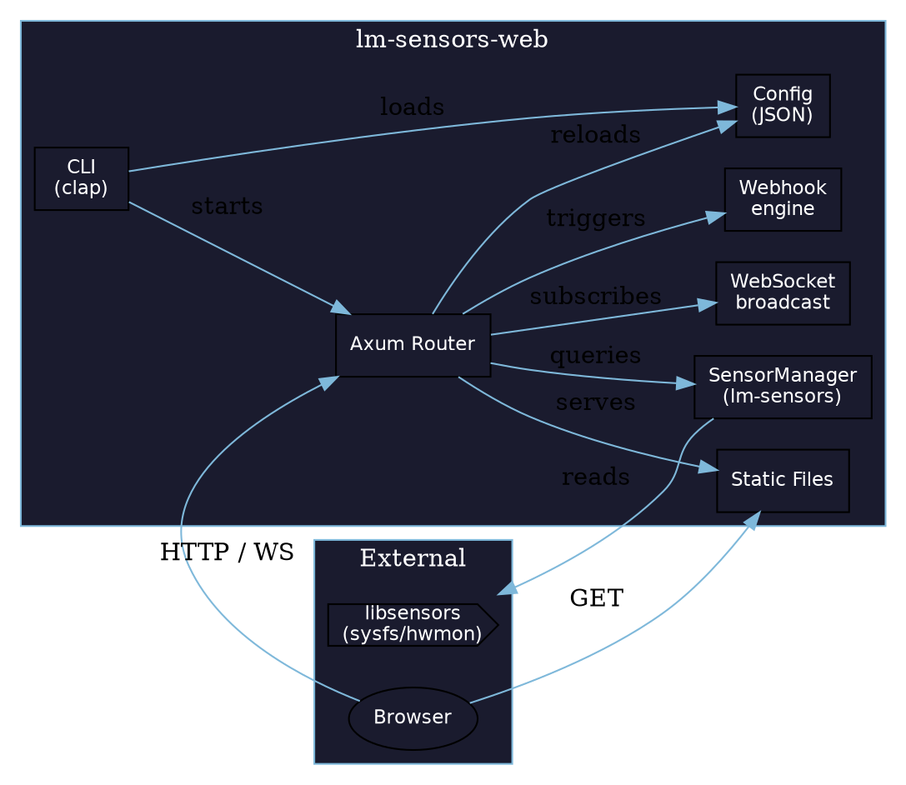
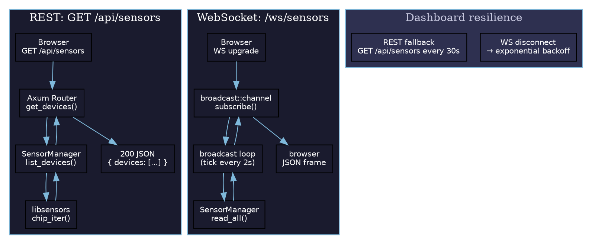
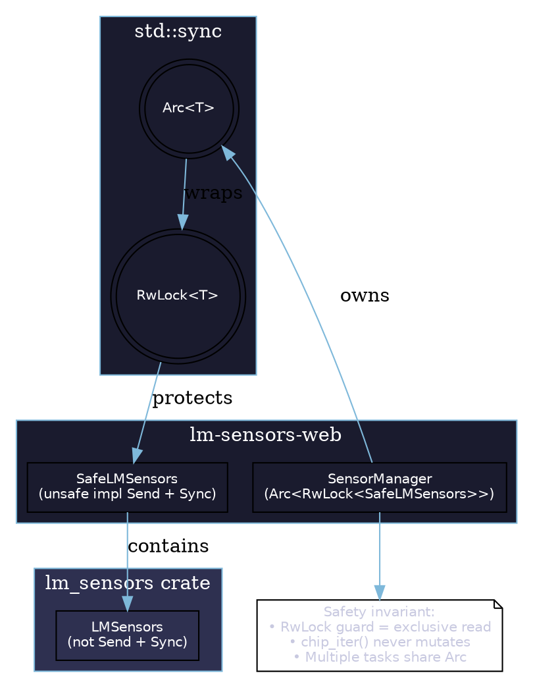

# lm-sensors-web

Hardware sensor monitoring web application built in Rust. Exposes real-time sensor data (temperatures, voltages, fan speeds, etc.) from Linux `libsensors` via a REST API, WebSocket live-feed, and a lightweight dark-mode web dashboard.


## Features

- **REST API** — `/api/sensors`, `/api/devices`, `/api/devices/{id}`, `/api/devices/{id}/features`, `/api/health`
- **WebSocket** — live sensor broadcast on `/ws/sensors`
- **Webhooks** — scheduled sensor push with triggers (`always`, `temperature`, `on-change`)
- **Web Dashboard** — dark-mode UI with pastel-coloured sensor cards, real-time filter, collapsible grid
- **CLI** — `--host`, `--port`, `--log-level`, `--config`, service management subcommands
- **Docker** — multi-stage build + `docker-compose.yml`
- **Linux Service** — systemd install/uninstall/start/stop/restart/status

## Architecture

### Component diagram



### Request flow



### Sensor wrapper safety



## Quick Start

```bash
# Build
cargo build --release

# Run (binds to 0.0.0.0:47890)
./target/release/lm-sensors-web

# Open dashboard
open http://localhost:47890
```

## CLI

```
lm-sensors-web [FLAGS] [SUBCOMMAND]

Flags:
  -H, --host <HOST>        Bind address (default: 0.0.0.0)
  -p, --port <PORT>        Listen port (default: 47890)
  -l, --log-level <LEVEL>  Logging level (info|debug|trace|warn|error)
  -c, --config <PATH>      Path to config.json
  -h, --help               Print help

Subcommands:
  install-service          Install as systemd service
  uninstall-service        Remove systemd service
  start-service            Start service
  stop-service             Stop service
  restart-service          Restart service
  status-service           Show service status
```

## Config (`config.json`)

```json
{
  "server": {
    "host": "0.0.0.0",
    "port": 47890,
    "log_level": "info"
  },
  "websocket": {
    "enabled": true,
    "path": "/ws/sensors",
    "broadcast_interval_ms": 2000
  },
  "webhooks": [
    {
      "name": "temp-alert",
      "url": "http://localhost:9090/alerts",
      "method": "POST",
      "content_type": "application/json",
      "trigger": "temperature",
      "condition": { "above_celsius": 80 },
      "interval_seconds": 30
    }
  ],
  "sensors": {
    "refresh_interval_ms": 5000
  }
}
```

## Docker

```bash
docker compose up -d
```

## API Endpoints

| Method | Path | Description |
|---|---|---|
| `GET` | `/api/health` | Health check |
| `POST` | `/api/reload` | Hot-reload config |
| `GET` | `/api/devices` | List all devices |
| `GET` | `/api/devices/{device_id}` | Device details |
| `GET` | `/api/devices/{device_id}/features` | Device readings |
| `GET` | `/ws/sensors` | WebSocket live feed |

## Testing

```bash
cargo test
```

## License

MIT
